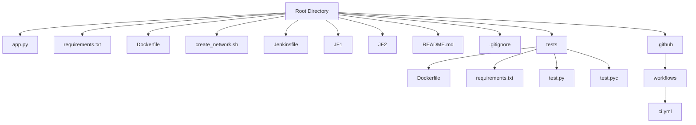
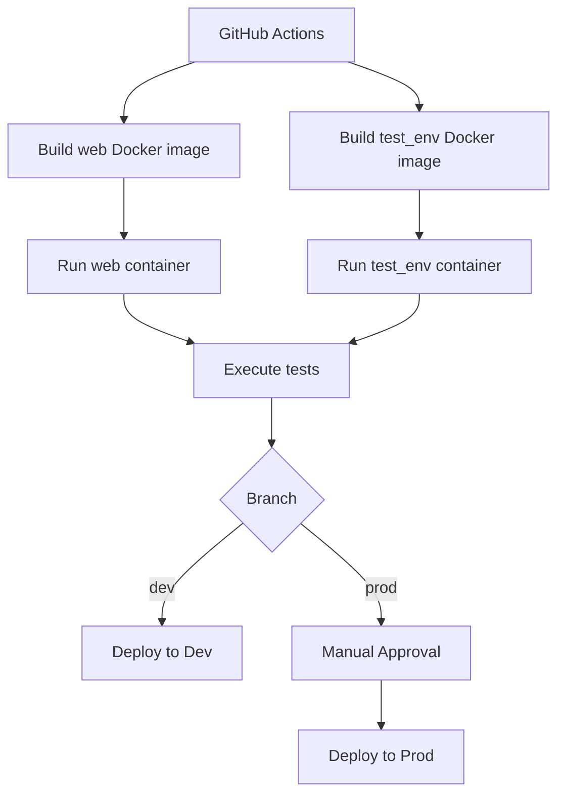
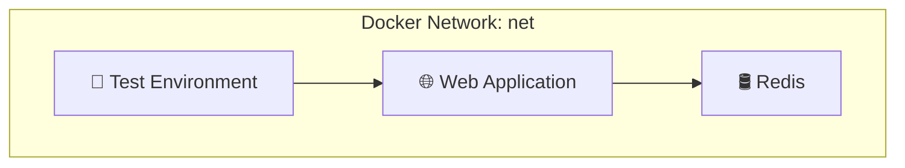

🤖 **MULTIBRANCH-PIPELINE-PROJECT** ⚙️
<br><br><br>
📦 **Project Overview**

This project demonstrates a comprehensive CI/CD pipeline for a Python application using Docker, Selenium, and GitHub Actions.

It supports multibranch workflows with automated testing and conditional deployments for dev and prod branches.

<br>

🗂️ **Project Structure**



🚀 **CI/CD with GitHub Actions:** the `ci.yml` workflow automates the following processes:

🔨 Build and Test

1. Checkout Code: retrieves the latest code from the repository.
2. Build Docker Images:
   
   a. `web`: for the Flask application.
   
   b. `test_env`: for the testing environment with Selenium.
   
3. Create Docker Network: establishes a network named `net` for container communication.
   
4. Run Containers:
   
   a. `Redis` (as a service).
   
   b. `Web` application.

5. Execute Tests: runs Selenium tests within the `test_env` container.
   
6. Cleanup: stops and removes containers after testing.
<br>

📦 **Deployment:** sequential deployment

1. `Dev`: automatically deploys when pushing to the `dev` branch.
   
2. `Prod`: deploys upon pushing to the `prod` branch, following manual approval.
<br>

🧪 **Testing with Selenium:** the tests perform the following checks:

1. Verifies the web application's accessibility.
   
2. Confirms the correct display of the header.

3. Ensures the visit counter increments upon page refresh.

4. Tests run in headless mode using Xvfb and `Firefox`.
<br>

🖼️ **CI/CD Workflow Diagram**



🛠️ **Local Setup:**
1. Build Docker Images
```bash
docker build -t web .
docker build -t test_env -f tests/Dockerfile tests/
```

2. Create Network
```bash
docker network create net
```

3. Run Redis
```bash
docker run --rm --network net -p 6379:6379 --name redis -d redis
```

4. Run Web Application
```bash
docker run --rm --network net -p 80:80 --name web -d web
```

5. Execute Tests
```bash
docker run --network net test_env
```

6. Cleanup
```bash
docker kill web redis
```

**🐳 Container Communication via Docker Network 🔗**


