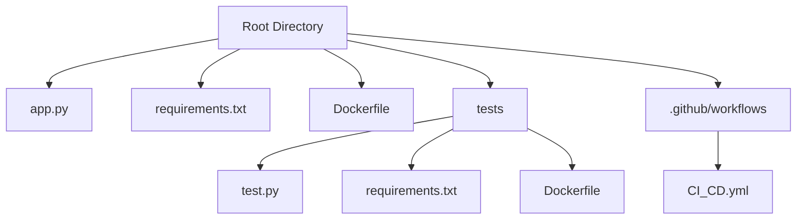
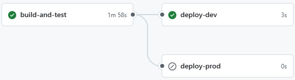
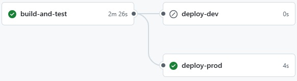

🤖 **MULTIBRANCH-PIPELINE-PROJECT** ⚙️
<br><br><br>
📦 **Project Overview**

This project demonstrates a comprehensive CI/CD pipeline for a Python application using Docker, Selenium, and GitHub Actions.
 
It supports multibranch workflows with automated testing and conditional deployments for dev and prod branches.

<br>

🗂️ **Project Structure**



<div align="center"> <table> <tr> <td align="center"><b>Deploy from Dev branch</b></td> <td align="center"><b>Deploy from Prod branch</b></td> </tr> <tr> <td align="center">  </td> <td align="center">  </td> </tr> </table> </div>

🚀 **CI/CD with GitHub Actions:** the `CI_CD.yml` workflow automates the following processes:

🔨 Build and Test

1. Checkout Code: retrieves the latest code from the repository.
   
2. Create Docker Network: establishes a network named `net` for container communication.
   
3. Build Docker Images:
   
   a. `web`: for the Flask application.
   
   b. `test_env`: for the testing environment with Selenium.
   
4. Run Containers:
   
   a. `Redis` (as a service).
   
   b. `Web` application.

5. Execute Tests: runs Selenium tests within the `test_env` container.
   
6. Cleanup: stops and removes containers after testing.
<br>

📦 **Deployment:** sequential deployment

1. `Dev`: automatically deploys when pushing to the `dev` branch.
   
2. `Prod`: deploys upon pushing to the `prod` branch, following manual approval.
<br>

🧪 **Testing with Selenium:** The tests perform the following checks:

1. Verifies the web application's accessibility.
   
2. Confirms the correct display of the header.

3. Ensures the visit counter increments upon page refresh.

4. Tests run in headless mode using `Chrome`.
<br>

🖼️ **CI/CD Workflow Diagram**


🛠️ **Local Setup:**
1. Create Network
```bash
docker network create net
```

2. Build Docker Images
```bash
docker build -t web .
docker build -t test_env -f tests/Dockerfile tests/
```

3. Run Redis
```bash
docker run --rm --network net --name redis -p 6379:6379 -d redis
```

4. Run Web Application
```bash
docker run --rm --network net --name web -p 80:80 -d web
```

5. Execute Tests
```bash
docker run --network net test_env
```

6. Cleanup
```bash
docker kill web redis
```

**🐳 Container Communication via Docker Network 🔗**

```mermaid
graph TD
    subgraph Docker Network: net
        test_env["🧪 Test Environment"]
        web["🌐 Web Application"]
        redis["🛢️ Redis"]
    end

    test_env --> web
    web --> redis
```


